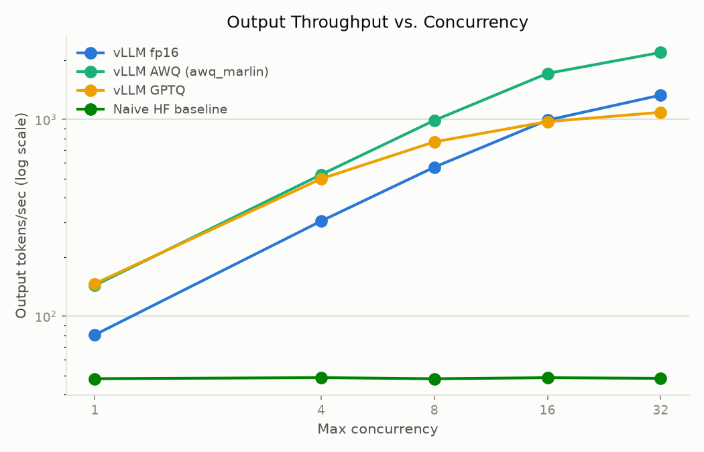
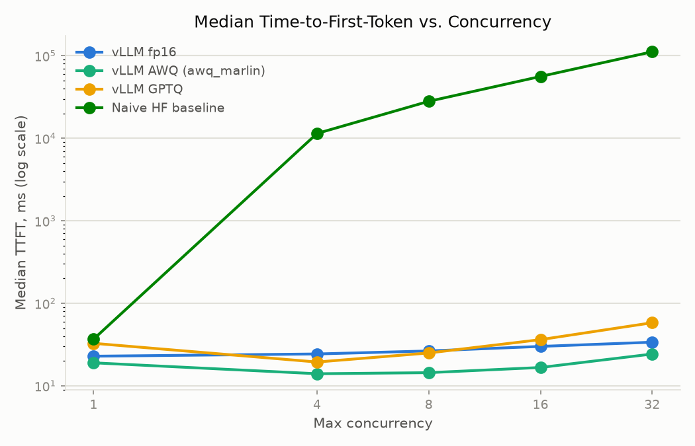
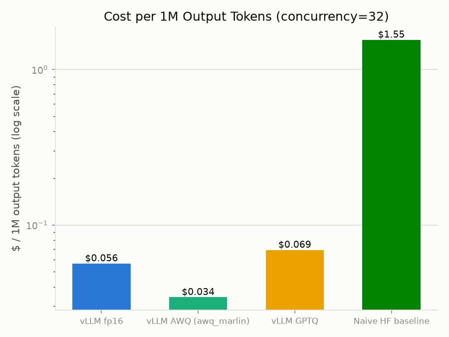
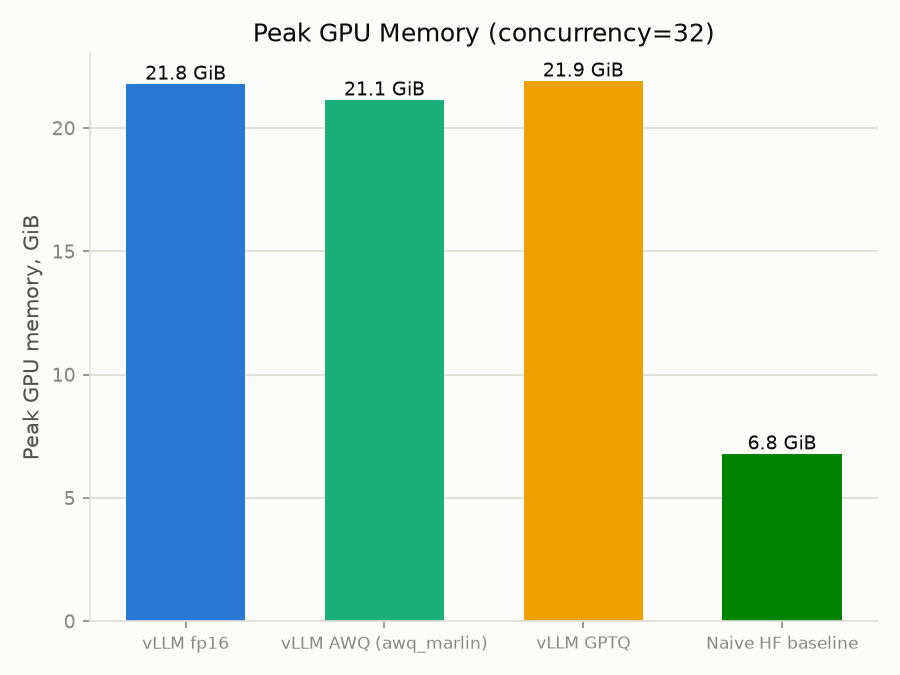
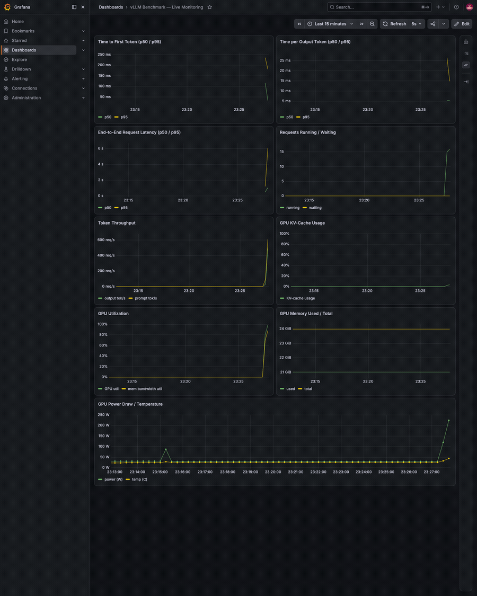
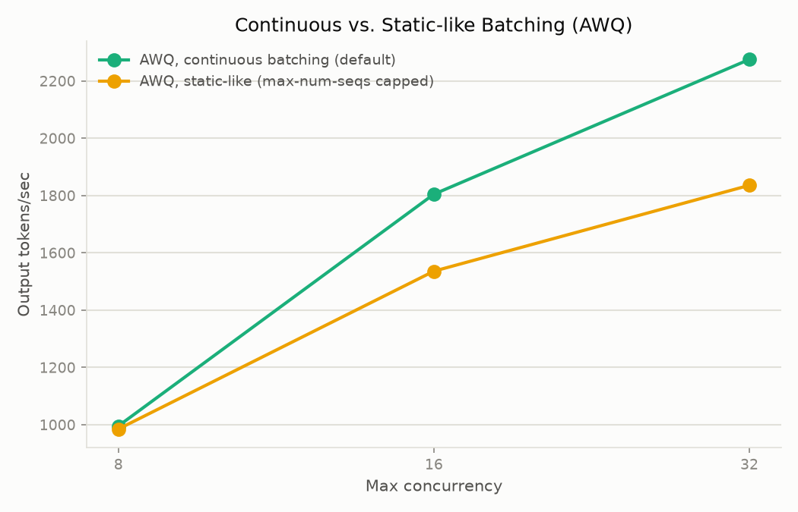
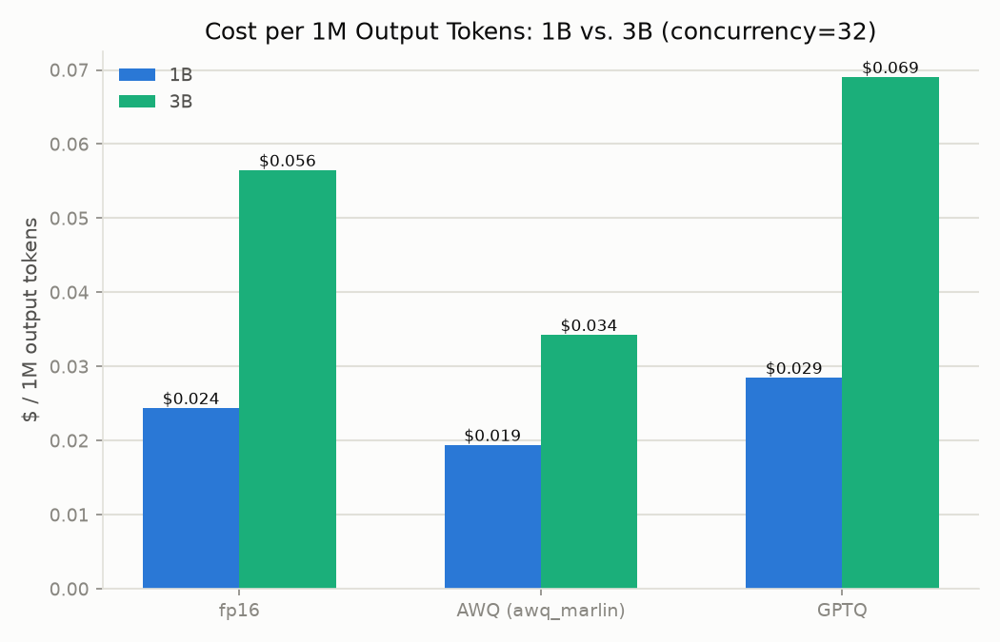

# vLLM Inference Benchmarking — Results

A benchmark of LLM serving performance for Llama-3.2-3B, comparing vLLM
(fp16, AWQ, GPTQ) against a naive HuggingFace `transformers.generate()`
baseline, on a single rented RTX A5000 GPU. Solo, 3-week portfolio project.

## Problem Statement

Serving an LLM behind an API is not just "call `generate()` in a loop." Production
inference engines like vLLM add continuous batching, paged KV-cache
management, and quantized kernels — but how much do these actually buy you,
and at what cost in complexity, memory, and dollars? This project measures
that gap directly: the same model, the same hardware, the same workload,
served two ways (vLLM vs. a from-scratch naive baseline), across three
weight formats (fp16, AWQ, GPTQ) and five concurrency levels, with a cost
model translating throughput into $/1M tokens.

## Methodology

- **Hardware**: 1x RTX A5000 (24GB VRAM), rented on RunPod at $0.27/hr,
  Ampere architecture (compute capability 8.6).
- **Model**: `meta-llama/Llama-3.2-3B-Instruct`, fp16 baseline, plus
  pre-quantized AWQ (`casperhansen/llama-3.2-3b-instruct-awq`) and GPTQ
  (`ModelCloud/Llama-3.2-3B-Instruct-gptqmodel-4bit-vortex-v3`) checkpoints
  sourced from HuggingFace Hub rather than quantized from scratch.
- **Serving engine**: vLLM 0.8.5, `--max-model-len 8192` (capped from the
  model's 131K default to fit the 24GB card's KV-cache budget).
- **Baseline**: a from-scratch FastAPI server (`baseline/hf_inference_server.py`)
  implementing the real OpenAI `/v1/completions` SSE contract directly, so
  the same benchmark client works against it unmodified. "Naive" is scoped
  specifically to **no continuous batching** — a single lock serializes
  requests server-side. Two silent slow-path traps were fixed as part of a
  fairness audit (fp32-default dtype, eager-attention default) since they
  aren't part of what the comparison is meant to measure; no continuous
  batching and no `torch.compile` were kept as the actual point of the
  comparison.
- **Load generator**: vLLM's own vendored `benchmark_serving.py`
  (`benchmarks/vendor/`), not reimplemented — it already covered ShareGPT
  sampling, concurrency sweeps, and TTFT/TPOT/throughput percentile
  reporting.
- **Workload**: real ShareGPT conversation prompts, 100 requests per run,
  swept across `--max-concurrency` 1 / 4 / 8 / 16 / 32.
- **Cost model**: `benchmarks/cost_model.py` — $/1M tokens = (hourly rate ÷
  3600) ÷ measured tokens/sec, purely retrospective against the saved
  benchmark JSON (no re-run needed to compute it).
- **Observability**: Prometheus scraping vLLM's native `/metrics` +
  `nvidia_gpu_exporter`, visualized in Grafana — for live monitoring during
  a run, not used to produce the numbers below (see Limitations).

## Results

### Throughput vs. concurrency



| concurrency | fp16 (tok/s) | AWQ (tok/s) | GPTQ (tok/s) | baseline (tok/s) |
|---|---|---|---|---|
| 1  | 80.4   | 143.4  | 146.3  | 48.1 |
| 4  | 304.3  | 524.2  | 499.1  | 48.7 |
| 8  | 571.7  | 988.4  | 768.6  | 48.1 |
| 16 | 990.9  | 1712.5 | 974.0  | 48.7 |
| 32 | 1327.5 | 2187.9 | 1086.2 | 48.3 |

The baseline's throughput is flat regardless of concurrency — by design,
it processes one request at a time, so extra concurrent requests just
queue instead of being batched. All three vLLM configs scale with
concurrency via continuous batching. At concurrency=32, vLLM's advantage
over the naive baseline ranges from **~22.5x (GPTQ) to ~45.3x (AWQ)**.

### Latency (time-to-first-token)



| concurrency | fp16 median TTFT (ms) | AWQ median TTFT (ms) | GPTQ median TTFT (ms) | baseline median TTFT (ms) |
|---|---|---|---|---|
| 1  | 22.9 | 19.0 | 32.7 | 36.8 |
| 4  | 24.3 | 14.0 | 19.4 | 11,434.9 |
| 8  | 26.5 | 14.4 | 25.0 | 28,035.9 |
| 16 | 30.0 | 16.7 | 36.3 | 56,064.2 |
| 32 | 33.8 | 24.3 | 58.1 | 111,705.0 |

The baseline's TTFT grows roughly linearly with concurrency (queueing
delay, not per-request slowdown — median TPOT stays ~21ms flat at every
level) and is already **2-3 orders of magnitude worse than any vLLM
config at concurrency=4**. Among the vLLM configs, AWQ has the lowest
median TTFT at every concurrency level tested in this run; GPTQ is the
most concurrency-sensitive, with its median TTFT growing from 32.7ms at
c=1 to 58.1ms at c=32 (worse than fp16 at high concurrency, unlike AWQ).

### Cost per 1M tokens



| config | $/1M output tokens (c=32) | $/1M total tokens (c=32) |
|---|---|---|
| AWQ (awq_marlin) | $0.0343 | $0.0161 |
| fp16 | $0.0565 | $0.0265 |
| GPTQ | $0.0691 | $0.0328 |
| Naive HF baseline | $1.5529 | $0.7285 |

Cost is the direct inverse of throughput (same $0.27/hr rate divided by
tokens/sec), so this table is a restatement of the throughput numbers in
dollar terms: the naive baseline costs **~22-45x more per token** than any
vLLM config at realistic (32-concurrent) load — the same ratio as the
throughput gap, since neither side's hardware cost changes.

### Memory tradeoff



| config | peak GPU memory |
|---|---|
| fp16 | 21.8 GiB |
| AWQ (awq_marlin) | 21.1 GiB |
| GPTQ | 21.9 GiB |
| Naive HF baseline | 6.8 GiB |

Peak memory is essentially flat across concurrency levels for every
config (vLLM pre-reserves its KV-cache block pool at startup regardless of
load; the baseline only ever holds one request's KV cache since it
processes serially) — so this is a per-config property, not a
concurrency-dependent one. The naive baseline uses **~3.1-3.3x less
peak GPU memory** than any vLLM config, at every concurrency level. This
is a real tradeoff, not a vLLM weakness: `gpu_memory_utilization=0.9`
(vLLM's default) trades memory headroom for the ability to serve many
concurrent requests without re-allocating KV cache mid-run.

### Observability



The Prometheus/Grafana stack (see Methodology) running live against the
AWQ config during a benchmark sweep — GPU utilization, power draw, token
throughput, and requests running/waiting all visibly respond to the
traffic burst.

### Continuous vs. static batching (AWQ, addendum)



vLLM 0.8.5 has no flag to disable continuous batching outright — its
scheduler (`vllm/core/scheduler.py`) admits a waiting request into a freed
slot on every decode step by design; there is no "wait for the whole batch
to drain" mode (confirmed by reading the pinned tag's source, not assumed).
Passing `--enable-chunked-prefill false`, the other candidate flag, turned
out not to work either — vLLM 0.8.5's V1 engine (the default here)
unconditionally re-enables it in `EngineArgs._set_default_args_v1`, and the
server's own startup log confirms it: `chunked_prefill_enabled=True` even
when `--no-enable-chunked-prefill` (the correct CLI syntax, an
argparse boolean flag rather than a `true`/`false`-valued option) is passed.
So the "static" configuration below is `--max-num-seqs <concurrency>` alone
— capping the running batch to exactly the concurrency under test, the
closest configurable approximation available, not literal static batching.

| concurrency | continuous (tok/s) | static-like (tok/s) | continuous median TTFT (ms) | static-like median TTFT (ms) |
|---|---|---|---|---|
| 8  | 995.9  | 985.1  | 41.7 | 42.0 |
| 16 | 1804.8 | 1536.2 | 30.4 | 57.4 |
| 32 | 2275.3 | 1835.8 | 43.4 | 89.3 |

At concurrency=8 the two are nearly identical (default `max_num_seqs` is
256, so it wasn't constraining the running batch any tighter than 8 anyway
— this is the expected null result, not noise). As concurrency rises, the
gap opens: static-like throughput trails continuous by **~15% at
concurrency=16 and ~19% at concurrency=32**, and its median TTFT nearly
doubles (42.0ms → 89.3ms) while continuous stays roughly flat (41.7ms →
43.4ms). Since chunked prefill was confirmed still active in both configs,
`max_num_seqs` alone is producing this gap — most likely by shrinking the
range of batch sizes vLLM captures CUDA graphs and sizes its scheduling
budget for at server startup, not by changing request-admission policy
(which, per the source, doesn't change either way). This wasn't isolated
further — a genuine limitation of approximating "static batching" with
vLLM's own knobs rather than a separate serving system built to actually
process fixed batches to completion.

### Does this generalize? (1B vs. 3B)

Everything above is for Llama-3.2-3B. To check whether it holds at a
different model size, the same fp16/AWQ/GPTQ sweep (concurrency 1/4/8/16/32,
100 ShareGPT prompts) was re-run against Llama-3.2-1B-Instruct, using
pre-quantized checkpoints in the same format/methodology as the 3B ones
(`AMead10/Llama-3.2-1B-Instruct-AWQ` — identical `bits=4/group_size=128/
awq_marlin`-compatible config to the 3B AWQ checkpoint;
`ModelCloud/Llama-3.2-1B-Instruct-gptqmodel-4bit-vortex-v2.5` — same
publisher and `gptqmodel` methodology, same `group_size=32`, as the 3B
GPTQ checkpoint).



| conclusion from the 3B results | holds at 1B? | evidence |
|---|---|---|
| AWQ wins on cost/throughput | **yes** | AWQ is cheapest at both sizes: $0.019/1M (1B) and $0.034/1M (3B) at concurrency=32, vs. fp16 ($0.024 / $0.056) and GPTQ ($0.029 / $0.069) |
| GPTQ edges out AWQ at concurrency=1, then falls behind as concurrency rises | **yes** | 1B: GPTQ leads at c=1 (303.1 vs. AWQ's 247.7 tok/s) but ends up *slower than fp16* at c=32 (2631.3 vs. fp16's 3072.1) — the same crossover shape as 3B (GPTQ 146.3 vs. AWQ 143.4 at c=1, then GPTQ 1086.2 < fp16 1327.5 at c=32) |
| GPTQ's median TTFT degrades faster than AWQ's/fp16's under load | **yes** | 1B GPTQ median TTFT: 20.2ms (c=1) → 37.7ms (c=32), ending worse than both fp16 (20.4ms) and AWQ (21.8ms) — mirrors the 3B finding (32.7ms → 58.1ms) |
| baseline gap (vLLM vs. naive HF) scales similarly | **not measured** | this addendum only swept fp16/AWQ/GPTQ for 1B, not the naive baseline — stating this as a gap rather than guessing |

One thing that did **not** scale the way intuition would suggest: **peak
GPU memory is nearly identical between 1B and 3B** (1B: 21.3–21.6 GiB vs.
3B: 21.1–21.9 GiB, at every concurrency level, for every config). A 3x
smaller model does not use proportionally less memory here, because
vLLM's default `gpu_memory_utilization=0.9` pre-reserves ~90% of the
card's memory for the KV-cache block pool at startup regardless of how
small the model's own weights are — on this GPU/config, memory footprint
is dominated by that reservation policy, not by model size. Anyone
sizing a deployment around "smaller model → less memory" on a
single shared GPU should check `gpu_memory_utilization` first.

Net: the qualitative story (AWQ fastest/cheapest, GPTQ's TTFT/high-
concurrency weakness, memory dominated by KV-cache reservation not model
size) reproduces at 1B with no exceptions found. The one open question is
the baseline comparison, which wasn't in scope for this addendum.

## Headline Findings

**1. A config bug, not a quantization result, initially made AWQ look like
the worst option.** The first full concurrency sweep showed AWQ as the
slowest of the three configs (518 output tok/s at concurrency=32, versus
fp16's 1327.5 and GPTQ's 1086.2) — a counter-intuitive result, since AWQ
should be at least competitive with GPTQ. The root cause, found by reading
the vLLM server's own startup log: `--quantization awq` was being passed
explicitly, which vLLM 0.8.5 respects even when the checkpoint is
Marlin-kernel-compatible on this Ampere GPU — forcing the older,
explicitly-labeled "not fully optimized" AWQ kernel path instead of the
fast `awq_marlin` kernel vLLM would have auto-selected if `--quantization`
had been left unset. Re-running with `--quantization awq_marlin` explicit
instead: **2187.9 output tok/s at concurrency=32, a ~4.2x improvement**,
making corrected AWQ the fastest of the three configs rather than the
slowest. This is the kind of bug that only surfaces by reading server logs
carefully rather than trusting a benchmark number at face value — the log
line literally named the fix (`Use quantization=awq_marlin for faster
inference`).

**2. vLLM's advantage compounds two independent effects that are easy to
conflate.** At concurrency=1 (no batching benefit for either side), vLLM is
still **1.7x (fp16) to ~3.0x (AWQ/GPTQ) faster per-token** than the naive
baseline — CUDA graphs, fused kernels, and quantized matmul kernels help
even at batch size 1. At concurrency=32, the gap widens to 22-45x, because
continuous batching now compounds with that same per-token speed
advantage. Reporting only the concurrency=32 number would overstate what
"vLLM's execution engine" specifically contributes, since some of that gap
is really "vLLM also batches and the baseline doesn't."

**3. The memory/throughput tradeoff is real and goes the other way.** The
naive baseline is not strictly worse — it uses 3.1-3.3x less peak GPU
memory than any vLLM config, at every concurrency level, because it never
pre-reserves a KV-cache block pool. On genuinely memory-constrained
hardware, or for a workload with very low expected concurrency, that
tradeoff could matter.

**4. AWQ is the strongest config in this run, but not unconditionally
"best."** With the kernel bug fixed, AWQ leads on throughput and median
TTFT at every concurrency level tested here. That's a real result on this
GPU, this model size, and this vLLM version — not a general claim about
AWQ vs. GPTQ. Two things this project does *not* measure temper it: (a)
output quality/accuracy of the quantized checkpoints was never evaluated,
so "fastest" says nothing about whether AWQ's or GPTQ's quantization
better preserves the model's outputs; (b) GPTQ's median TTFT specifically
degrades faster than AWQ's or fp16's as concurrency rises (32.7ms → 58.1ms
from c=1 to c=32, ending up worse than fp16 at c=32), which is worth
investigating further before treating this AWQ checkpoint/kernel
combination as a default choice.

## Limitations / What I'd Do Differently

- **Single GPU only** — no multi-GPU or multi-node serving was tested;
  tensor/pipeline parallelism behavior on this hardware is unknown.
- **No fine-tuning** — this project benchmarks inference only; training or
  fine-tuning throughput/cost is out of scope.
- **No output-quality evaluation** — AWQ and GPTQ checkpoints were compared
  purely on speed/memory/cost, never on whether quantization degraded
  response quality. A real deployment decision would need this.
- **Prometheus/Grafana are live-monitoring-only, not retrospective** — they
  were stood up after the Phase 1/2 benchmark runs completed, so there is
  no historical Prometheus data for the numbers in this report; they were
  verified against a separate live load-test, not the sweep data above.
- **Only two model sizes, both ≤3B** — the core results are for
  Llama-3.2-3B; a 1B generalization check (see "Does this generalize?"
  above) reproduced the same qualitative rankings, but larger models
  (8B+) where memory pressure and compute-bound-ness shift more
  significantly were never tested, and the 1B check didn't include the
  naive HF baseline.
- **One workload shape** — ShareGPT-distributed prompt/output lengths only;
  a workload with very long contexts or very short completions could shift
  which config wins (e.g. TTFT-bound vs. throughput-bound workloads).
- **Raw results are not in version control** — `results/*.json` is
  git-ignored as regenerable benchmark output; the numbers in this report
  are reproducible only by re-running the Phase 1/2 sweeps on rented
  hardware, not from git history alone. The generated charts/tables here
  are the durable artifact.

## Reproducing this report

All of this is retrospective against the results already checked into
this project's history of benchmark runs — no GPU or rented pod is needed:

```bash
pip install -r reports/requirements.txt
python3 benchmarks/cost_model.py          # cost table (stdout)
python3 reports/generate_charts.py        # writes reports/images/*.png
```

The continuous-vs-static-batching addendum needs a rented GPU to regenerate
(`benchmarks/run_batching_comparison.sh`, AWQ only, concurrency 8/16/32) —
`reports/generate_charts.py` skips `batching_comparison.png` automatically
if those result files aren't present.
